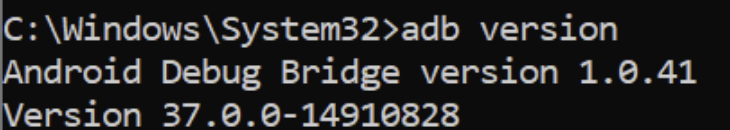
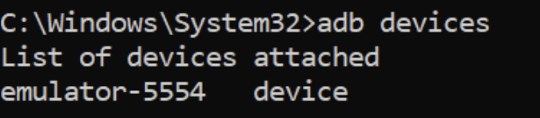
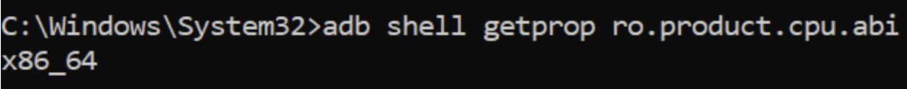
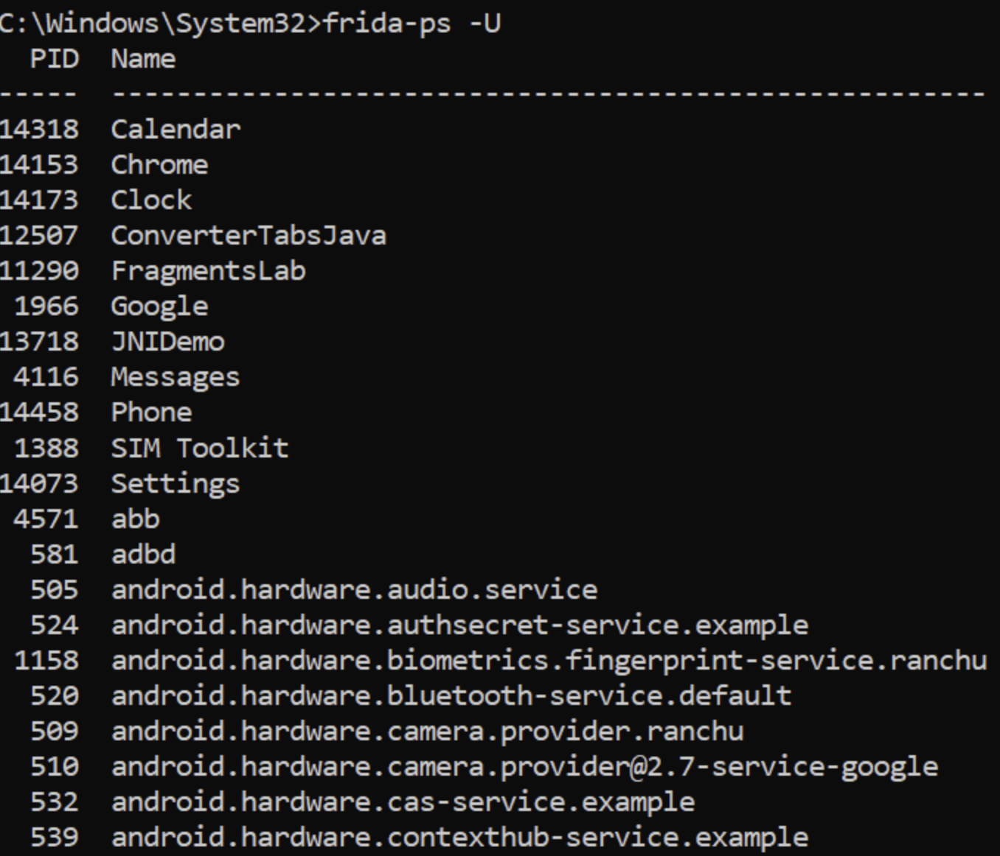
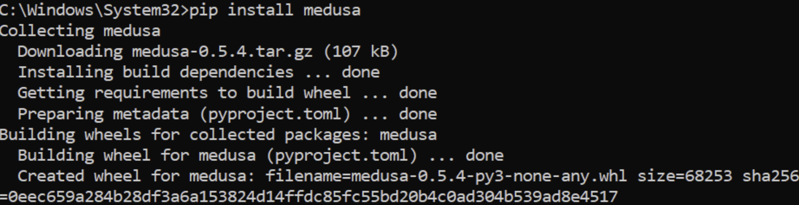
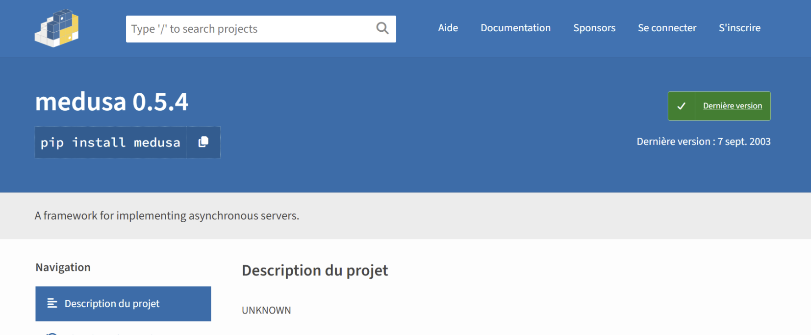
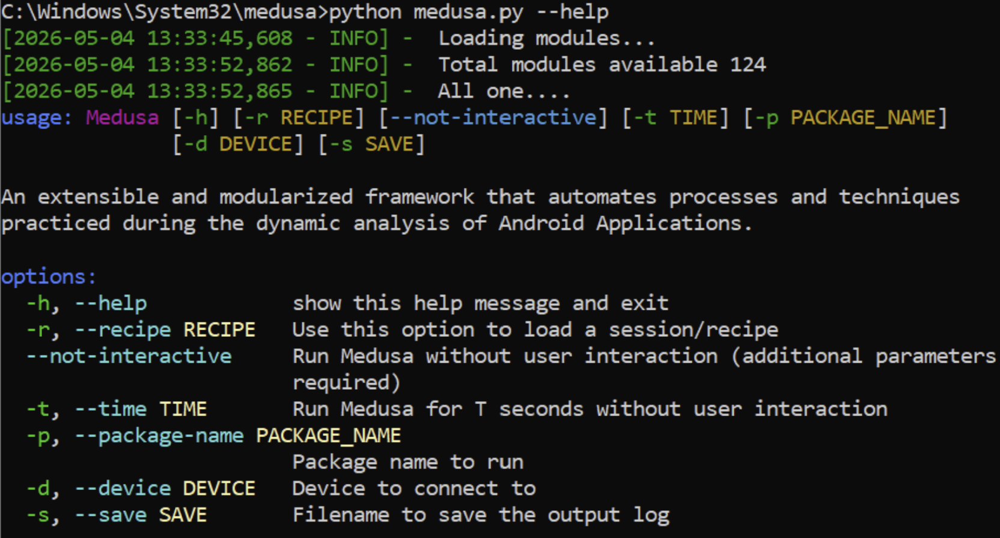
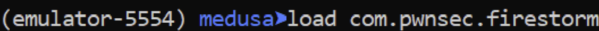
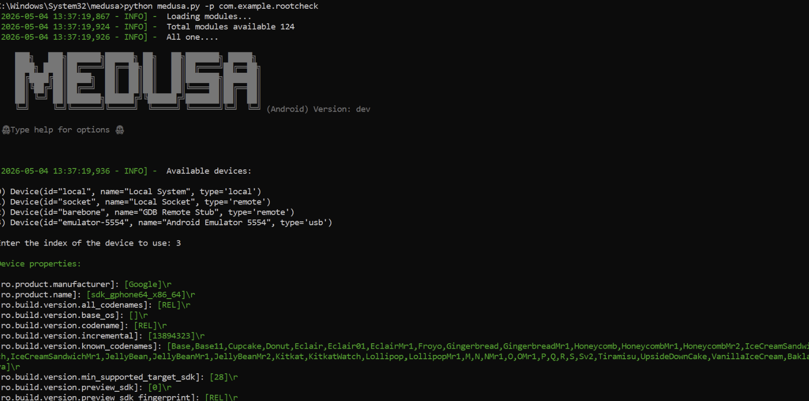
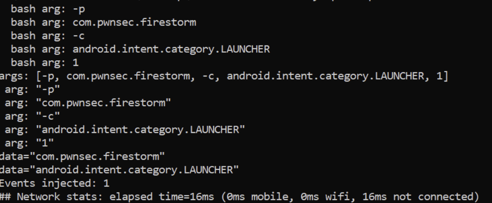

# LAB 12 – Bypass de la Détection de Root Android avec Medusa

**Auteur :** Oumayma Benhilal  
**Cours :** Sécurité des applications mobiles  

## Avertissement et objectifs

- **Objectif** : réaliser, pas à pas (niveau débutant), un bypass de la détection de root Android en utilisant l’outil Medusa (ensemble d’outils/scripts d’instrumentation basés sur Frida), puis valider que l’application ne « voit » plus le root.
- **Usage éthique** : n’utilisez ces techniques que sur des apps/appareils que vous êtes autorisé à tester.
- Ce guide fournit aussi un plan B avec Frida pur si Medusa n’est pas disponible ou échoue.

## Prérequis

- Émulateur Android rooté ou appareil physique rooté
- Frida installé et `frida-server` déployé
- Python 3 et `pip`
- Application cible avec détection de root (ex: DIVA, RootBeer, ou une app bancaire test)
- Connexion internet pour installer Medusa

---

## Déroulement du Lab

### Étape 1 – Préparer l’environnement Android et Frida
Avant d'instrumenter l'application, nous devons nous assurer que la communication avec l'appareil Android est fonctionnelle et que le serveur Frida est en cours d'exécution.

Vérification d'ADB et de la version :





Vérification de l'architecture du processeur de l'émulateur (utile pour savoir quelle version de Frida Server télécharger si besoin) :



Enfin, vérification que Frida peut communiquer avec l'appareil en listant les processus :



### Étape 2 – Installer Medusa (outil d’instrumentation)
Medusa peut s'installer facilement via `pip` ou se récupérer directement depuis son dépôt officiel.



Une fois installé, on peut vérifier que l'outil répond correctement en affichant l'aide globale de la commande :



### Étape 3 – Comprendre la détection de root (vue débutant)
La détection de root s'appuie sur plusieurs vérifications courantes faites par l'application :
- **Fichiers binaires** : Présence de `/system/bin/su` ou `/system/xbin/su`.
- **Propriétés système** : `ro.build.tags` contient la valeur `test-keys` au lieu de `release-keys`, ou `ro.debuggable` vaut 1.
- **Packages installés** : Présence d'applications comme SuperSU, Magisk, ou Xposed.
Si ces éléments sont détectés, l'application se ferme ou affiche une popup "Root detected".

### Étape 4 – Lancer l’app avec Medusa et activer le module de bypass root
Medusa automatise l'injection de scripts Frida. Nous démarrons Medusa en lui indiquant le nom du package cible.

Lancement interactif de Medusa (ici avec une app de test) :



Dans le terminal interactif de Medusa, on charge le module ou l'application cible :



### Étape 5 – Validation du bypass
Une fois le module de bypass activé, l'application s'exécute normalement. Medusa affiche dans son terminal les intents interceptés ou les tentatives de lecture de fichiers bloquées.



L'application cible ne voit plus le root et devient pleinement utilisable.

### Étape 6 – Dépannage (niveau débutant)
Il est fréquent de rencontrer des erreurs lors de l'utilisation de Frida ou Medusa.

**Problème courant :** Impossible de se connecter à `frida-server`.
**Solution :** Vérifiez que vous avez fait un `adb root` ou que vous avez lancé `/data/local/tmp/frida-server &` en tant qu'utilisateur `su` dans l'`adb shell`.

**Problème de crash :**

**Solution :** Vérifiez la version de Python ou assurez-vous que le nom du package fourni avec `-p` est exact.

---

## Plan B – Faire le même bypass avec Frida pur (si Medusa indisponible)
Si Medusa pose problème, l'approche manuelle avec Frida reste infaillible. Créez un fichier `bypass.js` contenant :

```javascript
Java.perform(function() {
    var File = Java.use("java.io.File");
    File.exists.implementation = function() {
        var path = this.getAbsolutePath();
        if(path.indexOf("su") !== -1) {
            console.log("[*] Bypass de la vérification du fichier : " + path);
            return false;
        }
        return this.exists();
    };
});
```

Puis exécutez-le avec :
```bash
frida -U -f com.example.app -l bypass.js --no-pause
```

---

## Exercices guidés
1. **Application tierce** : Téléchargez l'application vulnérable **DIVA (Damn Insecure and Vulnerable App)** et utilisez Medusa pour observer les vérifications d'environnement.
2. **Comparatif** : Implémentez un bypass manuel via Frida (Plan B) et comparez la verbosité des logs obtenus par rapport aux modules automatisés de Medusa.
3. **Module personnalisé** : Explorez l'arborescence de Medusa et essayez d'écrire un petit module qui loggue tous les appels à `android.util.Log`.

---

## Foire aux questions rapide
**Q: Medusa ne trouve pas mon appareil ?**  
R: Vérifiez que `adb devices` liste bien votre appareil et qu'il n'est pas "offline".

**Q: Medusa affiche "Module not found" lors du load ?**  
R: Assurez-vous d'utiliser la fonction de recherche de Medusa (ex: `search root`) pour trouver le nom exact du module.

---

## Conclusion personnelle
L'utilisation de Medusa apporte un gain de temps considérable par rapport à l'écriture de scripts Frida "from scratch". Son approche modulaire permet aux débutants de contourner rapidement les protections standards (Root, SSL Pinning) sans avoir à maîtriser la syntaxe JavaScript de Frida. Néanmoins, en cas d'obfuscation poussée ou de protections natives personnalisées, le retour à Frida pur (Plan B) reste essentiel pour faire du "sur-mesure". 

[Lien vers le dépôt GitHub](https://github.com/Oumaymaa659/LAB-12-Bypass-de-la-D-tection-de-Root-Android-avec-Medusa)
